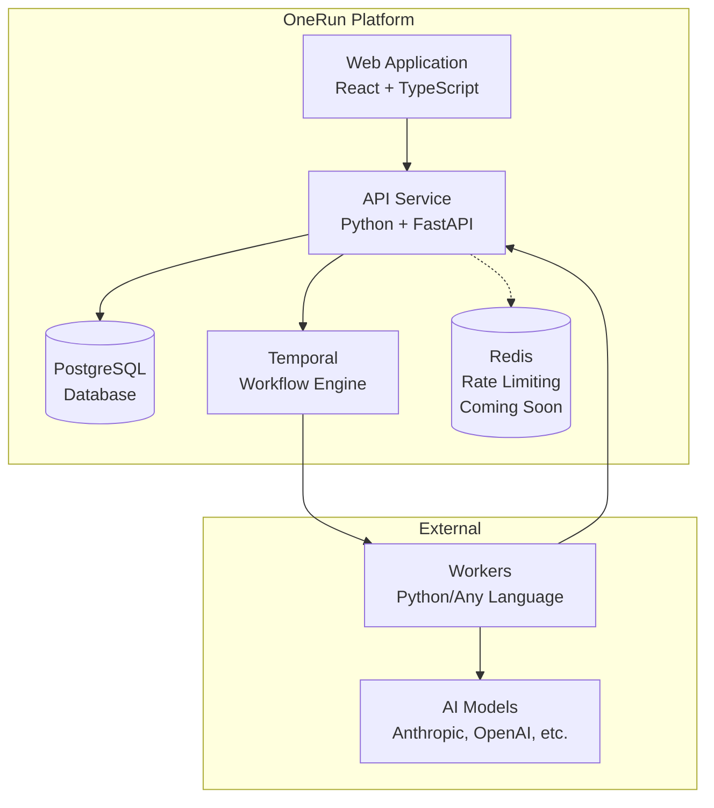
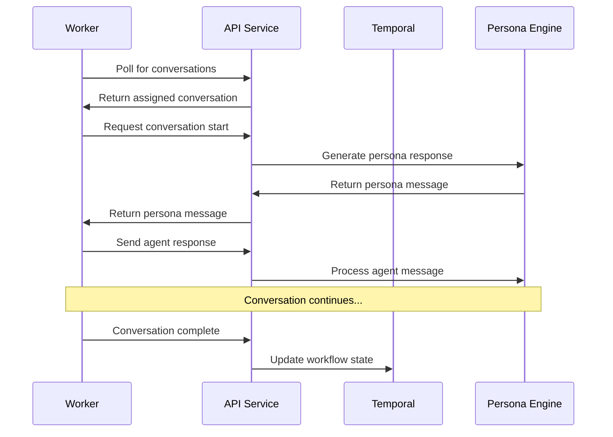

OneRun is built as a distributed system with multiple components working together to orchestrate AI agent evaluations. This page explains the overall architecture and how different parts interact.

## System Overview

OneRun consists of several key components:

- **Web Application** - React-based frontend for creating and managing evaluations
- **API Service** - Python backend with FastAPI handling business logic and data persistence
- **Database** - PostgreSQL for storing projects, agents, simulations, and results
- **Temporal** - Workflow orchestration for managing simulation lifecycles
- **Workers** - External processes that implement your AI agent logic
- **Redis** - Planned for rate limiting and caching (coming soon)

## Component Architecture

## Core Components

### Web Application

The frontend is a React application built with TypeScript that provides:

- **Project Management** - Create and organize evaluation projects
- **Agent Configuration** - Define agents and their objectives
- **Simulation Setup** - Configure test scenarios and parameters
- **Results Dashboard** - View evaluation results and analytics
- **User Management** - Authentication and access control

**Technologies**: React, TypeScript, Tailwind CSS, Recharts

### API Service

The backend API handles all business logic and data operations:

- **REST API** - Endpoints for all platform functionality
- **Authentication** - User management with Better-Auth
- **Data Validation** - Request/response validation with Pydantic models
- **Background Jobs** - Queued tasks for heavy operations
- **Real-time Updates** - WebSocket connections for live data

**Technologies**: Python, FastAPI, SQLAlchemy ORM, Better-Auth, Pydantic

### Database Layer

PostgreSQL stores all persistent data with a normalized schema:

- **Projects & Agents** - Core configuration entities
- **Simulations** - Test scenarios and their parameters
- **Conversations** - Individual agent-persona interactions
- **Evaluations** - Scoring results and feedback
- **Users & Permissions** - Authentication and access control

**Technologies**: PostgreSQL, SQLAlchemy ORM for migrations and queries

### Workflow Orchestration

Temporal manages complex, long-running simulation workflows:

- **Simulation Lifecycle** - Coordinate persona generation, conversations, and evaluation
- **Retry Logic** - Handle failures and partial completions gracefully  
- **Concurrency Control** - Manage parallel conversation execution
- **State Management** - Track simulation progress across restarts

**Technologies**: Temporal.io, Python workflows and activities

### External Workers

Workers are separate processes that implement your actual AI agent:

- **Framework Agnostic** - Use any AI framework or direct API calls
- **Language Flexible** - Python SDK provided, any language supported via API
- **Polling Model** - Workers poll for assigned conversations
- **Stateless Design** - Each conversation handled independently

## Data Flow

### Simulation Execution Flow

1. **User initiates simulation** through the web interface
2. **API validates** request and creates simulation record
3. **Temporal workflow** starts to orchestrate the simulation
4. **Persona generation** creates diverse conversation participants
5. **Conversation assignment** distributes work to available workers
6. **Workers poll** for assigned conversations via API
7. **Agent-persona dialogues** occur through API message exchange
8. **Evaluation scoring** happens after conversation completion
9. **Results aggregation** provides summary metrics and insights
10. **Dashboard updates** show real-time progress and final results

### Worker Communication Pattern

## Deployment Architecture

### Development Setup

For local development, all components run in Docker containers:

- **Temporal** runs in `docker/temporal` with `docker-compose`
- **Main services** run in `docker` directory with shared configuration
- **Workers** run locally using the Python SDK examples

### Production Deployment

Production deployments typically use:

- **Kubernetes** for container orchestration and scaling
- **Load balancers** for high availability and traffic distribution
- **Managed databases** for PostgreSQL and Redis
- **Container registry** for image management
- **Monitoring** with Prometheus, Grafana, and distributed tracing

## Security Considerations

### Data Protection

- **Encryption at rest** for sensitive conversation data
- **TLS encryption** for all API communications
- **API key authentication** for worker connections
- **Role-based access** for user permissions

### Network Security

- **Private networks** for internal component communication  
- **Firewall rules** restricting external access
- **Rate limiting** to prevent abuse
- **CORS policies** for frontend security

## Scalability Design

### Horizontal Scaling

- **Stateless workers** can be scaled independently
- **Database read replicas** for improved query performance
- **Redis clustering** for high-availability caching
- **Load balancing** across multiple API instances

### Performance Optimization

- **Connection pooling** for database efficiency
- **Response caching** for frequently accessed data
- **Async processing** for non-blocking operations
- **Batch operations** for bulk data processing

## Extensibility Points

### Custom Integrations

- **Worker SDK** for implementing agents in any language
- **Webhook support** for external system notifications
- **Plugin architecture** for custom evaluation criteria
- **API extensions** for domain-specific functionality

### Configuration Management

- **Environment-based** configuration for different deployment stages
- **Feature flags** for gradual rollout of new capabilities
- **Runtime configuration** for dynamic behavior adjustments
- **Multi-tenancy** support for enterprise deployments

This architecture provides a solid foundation for reliable, scalable AI agent evaluation while maintaining flexibility for different deployment scenarios and integration requirements.